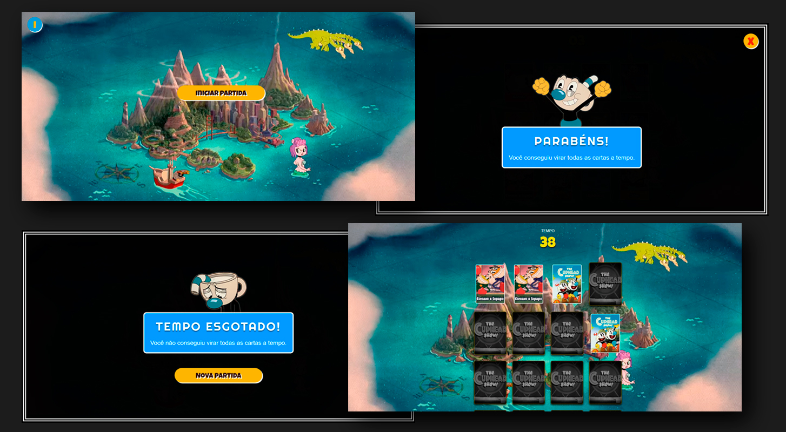

# 🎮 Jogo da Memória - Cuphead

Este é um projeto de estudo desenvolvido para aprimorar conhecimentos em desenvolvimento web utilizando JavaScript puro, HTML e CSS.

O tema do jogo foi inspirado no universo e na identidade visual da animação **Cuphead**, trazendo personagens, fundos e efeitos sonoros característicos diretamente para o navegador.

---

## 🚀 Como o projeto funciona

O objetivo do jogo é encontrar todos os pares de cartas antes que o tempo se esgote:

- **Início:** O jogador pode clicar em **"Iniciar Partida"** na tela inicial. Um botão de informações **(I)** também está disponível para apresentar as instruções do jogo.
- **Regras:** O jogador tem exatamente **60 segundos** para encontrar **10 pares de cartas** (totalizando 20 cartas).
- **Mecânica:** Ao clicar em uma carta, ela é revelada. Se a próxima carta escolhida for igual, o par é formado e as cartas continuam viradas. Caso contrário, as cartas são desviradas automaticamente após um breve momento.
- **Recursos inclusos:** \* Efeitos sonoros temáticos.
  - Contagem regressiva de tempo.
  - Telas interativas de **Vitória ("Parabéns!")** ou **Derrota ("Tempo Esgotado!")** com a opção de iniciar uma **"Nova Partida"**.

---

## 📷 Demonstração do Projeto

Aqui estão algumas capturas de tela do jogo em funcionamento:



---

## 🛠️ Tecnologias Utilizadas

Para o desenvolvimento deste projeto, foram utilizadas as seguintes tecnologias:

[](https://developer.mozilla.org/pt-BR/docs/Web/HTML)
[](https://developer.mozilla.org/pt-BR/docs/Web/CSS)
[](https://developer.mozilla.org/pt-BR/docs/Web/JavaScript)

---

## 🔗 Links Úteis

- **Visualizar o projeto online:** [Clique aqui para jogar](https://lucianosergiodasilva.github.io/jogodamemoriacuphead)

---

### 📥 Clonando o projeto

Você pode clonar este repositório para testar em sua máquina:

```bash
   git clone https://github.com/lucianosergiodasilva/jogodamemoriacuphead.git

```
